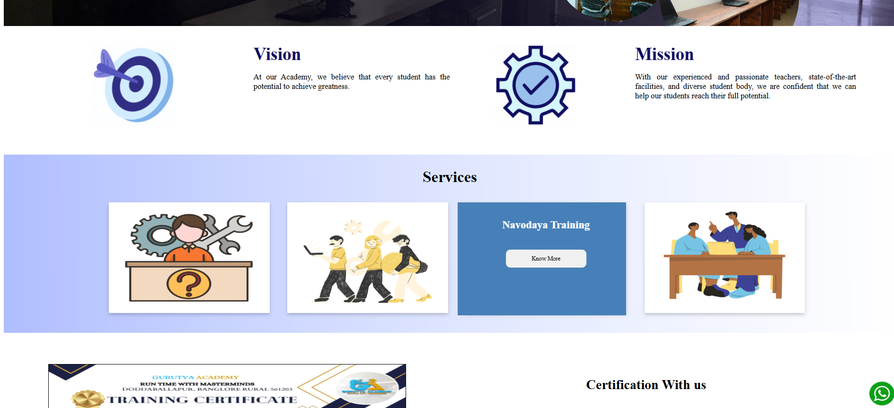

## 🔎 Note
This site is not live anymore, but the repository remains as part of my portfolio.
This was developed during my time at a startup for real clients.  
Although the site is not deployed live anymore, this repository showcases the code, design, and development work I contributed.

# Gurutva Academy
Educational website for a coaching academy, built to reflect the vision of helping students achieve their potential with experienced teachers and modern facilities.

## 🚀 Tech Stack
- HTML
- CSS
- JavaScript
- Firebase
- Canva

## ✨ Features
- Responsive design
- User-friendly layout
- 
## 📂 Project Context
Built as part of client projects at K-AKA Technology Services, focusing on delivering practical and visually appealing websites.

## 📸 Screenshots
  
